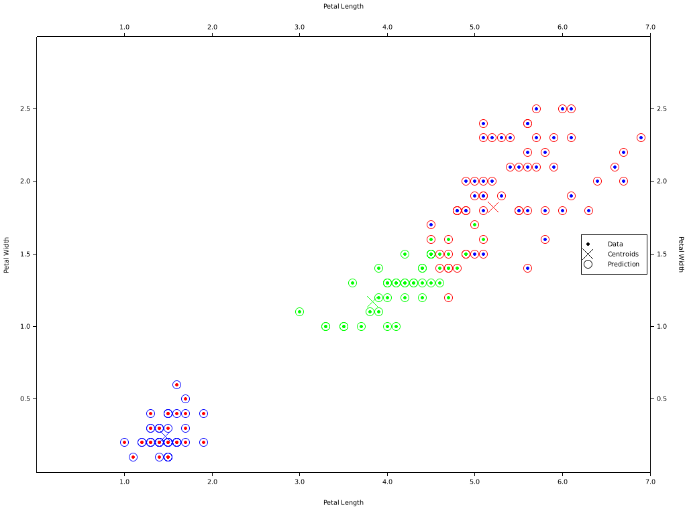
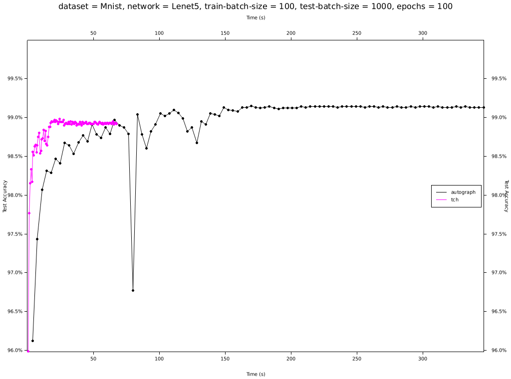

[![LicenseBadge]][License]
[![DocsBadge]][Docs]
[](https://github.com/charles-r-earp/autograph/actions)

[License]: https://github.com/charles-r-earp/autograph/blob/main/LICENSE-APACHE
[LicenseBadge]: https://img.shields.io/badge/license-MIT/Apache_2.0-blue.svg

[Docs]: https://docs.rs/autograph
[DocsBadge]: https://docs.rs/autograph/badge.svg


# **autograph**
A machine learning library for Rust.

To use **autograph** in your crate, add it as a dependency in Cargo.toml:
```
[dependencies]
autograph = { git = "https://github.com/charles-r-earp/autograph" }
```

# Requirements
- Rust <https://www.rust-lang.org/>
- A Vulkan <https://www.vulkan.org/> capable device (typically a gpu).

## Apple
MoltenVK <https://moltengl.com/moltenvk/> is provided on MacOS and iOS if no Vulkan drivers are detected.

# Tests
- To check that you have a valid device, run `cargo test device_new --features device_tests`.
- Run all the tests with `cargo test --features "full device_tests"`.

# Custom Shader Code
You can write your own shaders and execute them with **autograph**.
```rust
// shader/src/lib.rs

// Declare the push constants. Use `#[repr(C)]` to ensure that fields
// are not reordered.
#[repr(C)]
pub struct PushConsts {
    n: u32,
}

/// Computes `y' = `a` + `b`
///
/// `threads` can be up to 3 dimensions (x, y, z). This is the size of the `WorkGroup`. Generally
/// this should be a multiple of the hardware specific size, NVidia refers to this as the
/// `warp size`, which for NVidia is often 32 but sometimes 64. For AMD this is generally 64. 64
/// is a good default. Note that autograph will automatically choose the number of work groups to
/// execute given the global size, so it is not necessary for the function submitting the shader
/// to know the work group size.
///
/// # Note
/// autograph does check the size of the push constants, as well as the mutability of buffers. It
/// DOES NOT check their types. For example, a buffer can be declared like `&[u32]` but bound to a
/// `Slice<u8>`.
#[allow(unused)]
#[spirv(compute(threads(64)))]
pub fn add(
    // This is the unique id of the invocation, and is 3D (x, y, z) even though we are just using x.
    // This tells the invocation what index to compute.
    #[spirv(global_invocation_id)] global_id: UVec3,
    // Buffer `a`. As of now, `storage_buffer`, `descriptor_set`, and `binding` must all be
    // specified.
    // Because this is not modified, it can be bound to a `Slice`.
    #[spirv(storage_buffer, descriptor_set = 0, binding = 0)] a: &[u32],
    // Buffer `b`.
    // Because this is not modified, it can be bound to a `Slice`.
    #[spirv(storage_buffer, descriptor_set = 0, binding = 1)] b: &[u32],
    // Buffer `y`, the output.
    // This can only be bound to a `SliceMut`.
    #[spirv(storage_buffer, descriptor_set = 0, binding = 2)] y: &mut [u32],
    // Push constants, ie additional arguments passed at runtime.
    #[spirv(push_constant)] push_consts: &PushConsts,
) {
    let gid = global_id.x as usize;
    // Only process up to n, which is the length of the buffers.
    if global_id.x < push_consts.n {
        // The indexing operation is implemented by rust-gpu, and is the only way to access
        // the data, ie using `[T]::get()` and dereferencing &T or *const T will fail to compile.
        y[gid] = a[gid] + b[gid];
    }
}

// main.rs

/// Adds `a` to `b`.
fn add(a: Slice<u32>, b: Slice<u32>) -> Result<Buffer<u32>> {
    if a.len() != b.len() {
        return Err(anyhow!("{} != {}", a.len(), b.len()));
    }
    // Typically use `Buffer::alloc` here but it's unsafe.
    // `zeros()` runs a shader to fill the buffer, so it's unnecessary if it will be overwritten.
    let mut y = Buffer::zeros(a.device(), a.len())?;
    // The shader executes in "WorkGroups", which in the shader is defined to be [64, 1, 1]. This
    // means that even though we have just 1 item to process, it will actually run 64 invocations
    // aka threads. We have to pass `n` to prevent the extra invocations from writing outside of
    // the buffer.
    let n = y.len() as u32;
    let builder = module()?
        .compute_pass("add")?
        // `storage_buffer` at binding 0, must not be modified in the shader.
        .slice(a)?
        // `storage_buffer` at binding 1, must not be modified in the shader.
        .slice(b)?
        // `storage_buffer` at binding 2
        .slice_mut(y.as_slice_mut())?
        .push(n)?;
    unsafe {
        // Enqueues the shader with global size [n, 1, 1].
        // This method validates the arguments, and compiles the module for the device on first
        // use. Otherwise, this doesn't block, the internal device thread will submit work to the
        // device driver when it is ready.
        builder.submit([n, 1, 1])?;
    }
    Ok(y)
}

#[tokio::main]
async fn main() -> Result<()> {
    let device = Device::new()?;
    let x_in = [2];
    // Here we create a Slice<u32> from a &[u32].
    // We could also create a Buffer from a Vec, without copying.
    let x = Slice::from(x_in.as_ref())
        // Note that Host -> Device transfers are non-blocking, not async.
        .into_device(device.clone())
        .await?;
    /// Get the result of the addition.
    let y = add(x.as_slice(), x.as_slice())?;
    // Print out the result!
    println!("{:?} + {:?} = {:?}", x_in, x_in, y.read().await?.as_slice());
    Ok(())
}
```

See the [Hello Compute](examples/hello-compute) example.

# Machine Learning
## KMeans
```rust
// Create the device.
let device = Device::new()?;
// Create the dataset.
let iris = Iris::new();
// The flower dimensions are the inputs to the model.
let x_array = iris.dimensions();
// Select only Petal Length + Petal Height
// These are the primary dimensions and it makes plotting easier.
let x_array = x_array.slice(&s![.., 2..]);
// Create the KMeans model.
let kmeans = KMeans::new(iris.class_names().len())
    .into_device(device.clone())
    .await?;
// For small datasets, we can load the entire dataset into the device.
// For larger datasets, the data can be streamed as an iterator.
let x = CowTensor::from(x_array.view())
    .into_device(device)
    // Note that despite the await this will resolve immediately.
    // Host -> Device transfers are batched with other operations
    // asynchronously on the device thread.
    .await?;
// Construct a trainer.
let mut trainer = KMeansTrainer::from(kmeans);
// Intialize the model (KMeans++).
// Here we provide an iterator of n iterators, such that the trainer can
// visit the data n times. In this case, once for each centroid.
trainer.init(|n| std::iter::from_fn(|| Some(once(Ok(x.view().into())))).take(n))?;
// Train the model (1 epoch).
trainer.train(once(Ok(x.view().into())))?;
// Get the model back.
let kmeans = KMeans::from(trainer);
// Get the trained centroids.
// For multiple reads, batch them by getting the futures first.
let centroids_fut = kmeans.centroids()
    // The centroids are in a FloatArcTensor, which can either be f32 or bf16.
    // This will convert to f32 if necessary.
    .cast_to::<f32>()?
    .read();
// Get the predicted classes.
let pred = kmeans.predict(&x.view().into())?
    .into_dimensionality()?
    .read()
// Here we wait on all previous operations, including centroids_fut.
    .await?;
// This will resolve immediately.
let centroids = centroids_fut.await?;
// Get the flower classes from the dataset.
let classes = iris.classes().map(|c| *c as u32);
// Plot the results to "plot.png".
// Note that since KMeans is an unsupervised method the predicted classes will be arbitrary and
// not align to the order of the true classes (ie the colors won't be the same in the plot).
plot(&x_array.view(), &classes.view(), &pred.as_array(), &centroids.as_array())?;
```

See the [KMeans Iris](examples/kmeans-iris) example.

## Neural Networks
```rust
#[derive(Layer, Forward, Clone, Debug)]
struct Lenet5 {
    #[autograph(layer)]
    conv1: Conv,
    #[autograph(layer)]
    relu1: Relu,
    #[autograph(layer)]
    pool1: MaxPool,
    #[autograph(layer)]
    conv2: Conv,
    #[autograph(layer)]
    relu2: Relu,
    #[autograph(layer)]
    pool2: MaxPool,
    #[autograph(layer)]
    dense1: Dense,
    #[autograph(layer)]
    relu3: Relu,
    #[autograph(layer)]
    dense2: Dense,
    #[autograph(layer)]
    relu4: Relu,
    #[autograph(layer)]
    dense3: Dense,
}

impl Lenet5 {
    fn new() -> Result<Self> {
        let conv1 = Conv::from_inputs_outputs_kernel(1, 6, [5, 5]);
        let relu1 = Relu::default();
        let pool1 = MaxPool::from_kernel([2, 2])
            .with_strides(2)?;
        let conv2 = Conv::from_inputs_outputs_kernel(6, 16, [5, 5]);
        let relu2 = Relu::default();
        let pool2 = MaxPool::from_kernel([2, 2])
            .with_strides(2)?;
        let dense1 = Dense::from_inputs_outputs(256, 120);
        let relu3 = Relu::default();
        let dense2 = Dense::from_inputs_outputs(120, 84);
        let relu4 = Relu::default();
        let dense3 = Dense::from_inputs_outputs(84, 10)
            .with_bias(true)?;
        Ok(Self {
            conv1,
            relu1,
            pool1,
            conv2,
            relu2,
            pool2,
            dense1,
            relu3,
            dense2,
            relu4,
            dense3,
        })
    }
}
```
See the [Neural Network MNIST](examples/neural-network-mnist) example.

# Benchmarks


```
+-----------+------------+---------------+-----------------------+----------------------------------+
| Library   | Best Epoch | Best Accuracy | Time To Best Accuracy | Mean Epoch Time to Best Accuracy |
+===========+============+===============+=======================+==================================+
| autograph | 36         | 99.05%        | 37.94s                | 1.05s                            |
+-----------+------------+---------------+-----------------------+----------------------------------+
| tch       | 39         | 99.08%        | 27.95s                | 716.55ms                         |
+-----------+------------+---------------+-----------------------+----------------------------------+
```

See the [Neural Network](benchmarks/neural-network) benchark.

# Profiling
Currently requires nightly and feature "profile". Set the AUTOGRAPH_PROFILE environmental variable to 1 or True to produce a table of statistics for compute passes that are executed.
```
AUTOGRAPH_PROFILE=1 cargo +nightly run --feature profile
```
Will create a file "autograph_profile_summary.txt" like this:
```
+-------------------------+----------------------------------------------+---------+-------------+-----------+------------+
| Module                  | Entry                                        | Time %  | Invocations | Mean Time | Total Time |
+=========================+==============================================+=========+=============+===========+============+
| core                    | linalg::gemm_f32_splitk256_unr16_mica1_micb1 | 22.19 % | 150485504   | 1.00ns    | 272.77ms   |
+-------------------------+----------------------------------------------+---------+-------------+-----------+------------+
| core                    | linalg::gemm_f32_unr16_mica1_micb1           | 18.87 % | 768897792   | 0.00ns    | 231.94ms   |
+-------------------------+----------------------------------------------+---------+-------------+-----------+------------+
| core                    | kernel::im2col_2d_convolution_f32            | 17.24 % | 143104000   | 1.00ns    | 211.92ms   |
+-------------------------+----------------------------------------------+---------+-------------+-----------+------------+
| core                    | linalg::gemm_f32_unr8_mica4_micb4            | 15.11 % | 55810560    | 3.00ns    | 185.71ms   |
+-------------------------+----------------------------------------------+---------+-------------+-----------+------------+
| core                    | kernel::col2im_2d_convolution_f32            | 5.24 %  | 48941568    | 1.00ns    | 64.35ms    |
+-------------------------+----------------------------------------------+---------+-------------+-----------+------------+
| core                    | reorder::as_standard_layout_4d_u32           | 4.17 %  | 500518400   | 0.00ns    | 51.23ms    |
+-------------------------+----------------------------------------------+---------+-------------+-----------+------------+
| core                    | fill::fill_u32x2                             | 3.83 %  | 550491136   | 0.00ns    | 47.05ms    |
+-------------------------+----------------------------------------------+---------+-------------+-----------+------------+
| core                    | pool::max_pool_indices_2d_f32                | 2.35 %  | 121638400   | 0.00ns    | 28.94ms    |
+-------------------------+----------------------------------------------+---------+-------------+-----------+------------+
| core                    | activation::relu_backward_f32                | 2.35 %  | 261534720   | 0.00ns    | 28.87ms    |
+-------------------------+----------------------------------------------+---------+-------------+-----------+------------+
| core                    | pool::max_pool_2d_backward_f32               | 1.95 %  | 314828800   | 0.00ns    | 23.99ms    |
+-------------------------+----------------------------------------------+---------+-------------+-----------+------------+
| reduce_sum_final_f32    | main                                         | 1.92 %  | 35776       | 661.00ns  | 23.65ms    |
+-------------------------+----------------------------------------------+---------+-------------+-----------+------------+
| core                    | activation::relu_f32                         | 1.37 %  | 261880320   | 0.00ns    | 16.87ms    |
+-------------------------+----------------------------------------------+---------+-------------+-----------+------------+
| scaled_add_f32          | main                                         | 0.88 %  | 24819840    | 0.00ns    | 10.87ms    |
+-------------------------+----------------------------------------------+---------+-------------+-----------+------------+
| core                    | criterion::cross_entropy_loss_backward_f32   | 0.52 %  | 71552       | 88.00ns   | 6.33ms     |
+-------------------------+----------------------------------------------+---------+-------------+-----------+------------+
| core                    | cast::scale_u8_f32                           | 0.45 %  | 43825600    | 0.00ns    | 5.50ms     |
+-------------------------+----------------------------------------------+---------+-------------+-----------+------------+
| core                    | criterion::cross_entropy_loss_f32            | 0.40 %  | 71552       | 68.00ns   | 4.94ms     |
+-------------------------+----------------------------------------------+---------+-------------+-----------+------------+
| bias_backward_f32       | main                                         | 0.35 %  | 35776       | 120.00ns  | 4.32ms     |
+-------------------------+----------------------------------------------+---------+-------------+-----------+------------+
| core                    | linalg::c_beta_f32                           | 0.24 %  | 1466624     | 2.00ns    | 2.94ms     |
+-------------------------+----------------------------------------------+---------+-------------+-----------+------------+
| reduce_argmax_final_f32 | main                                         | 0.17 %  | 71552       | 29.00ns   | 2.08ms     |
+-------------------------+----------------------------------------------+---------+-------------+-----------+------------+
| one_hot_u8_f32          | main                                         | 0.15 %  | 71552       | 25.00ns   | 1.81ms     |
+-------------------------+----------------------------------------------+---------+-------------+-----------+------------+
| core                    | fill::fill_u32                               | 0.13 %  | 143360      | 10.00ns   | 1.57ms     |
+-------------------------+----------------------------------------------+---------+-------------+-----------+------------+
| accuracy_u8             | main                                         | 0.12 %  | 71552       | 20.00ns   | 1.44ms     |
+-------------------------+----------------------------------------------+---------+-------------+-----------+------------+
```
### Note
Specify the profile feature for autograph if it is a dependency as `autograph/profile`.

# License
Dual-licensed to be compatible with the Rust project.

Licensed under the Apache License, Version 2.0 http://www.apache.org/licenses/LICENSE-2.0 or the MIT license http://opensource.org/licenses/MIT, at your option. This file may not be copied, modified, or distributed except according to those terms.

# Contribution
Unless you explicitly state otherwise, any contribution intentionally submitted for inclusion in the work by you, as defined in the Apache-2.0 license, shall be dual licensed as above, without any additional terms or conditions.
